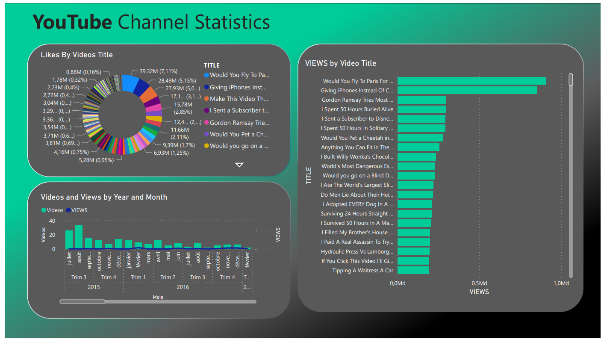

# ETL Project : The Youtube Data Engineering pipeline

## Table of Contents
1. [Introduction](#introduction)
2. [Project Overview](#project-overview)
3. [Tools Used](#tools-used)
4. [Project Steps](#project-steps)
   - [Step 1: Web Scraping](#step-1-web-scraping)
   - [Step 2: CSV File Creation](#step-2-csv-file-creation)
   - [Step 3: Load Data to Snowflake Data Warehouse](#step-3-load-data-to-snowflake-data-warehouse)
   - [Step 4: Reporting with Power BI](#step-4-reporting-with-power-bi)
5. [Acknowledgment](#acknowledgment)
6. [Contacts](#contacts)

## Introduction
This `README` document provides an overview of an `ETL` (Extract, Transform, Load) project developed to extract data from a `YouTube` channel using the YouTube API and `Python`, perform data transformations with the `Pandas` library, export the transformed data to a CSV file, load the data into `Snowflake` data warehouse, and create a reporting dashboard using `Power BI`.

## Project Overview
The project aims to automate the extraction of data from a YouTube channel, transform the data into a suitable format, and make it available for analysis through a Power BI dashboard. By following a structured ETL process, this project streamlines data retrieval, preparation, and visualization.

## Tools Used
- `Python`: Used for scripting and data manipulation.
- `Pandas`: Employed for data transformation and manipulation.
- `YouTube API`: Utilized for data extraction from the YouTube channel.
- `Snowflake` Data Warehouse: Used as the central repository for storing the transformed data.
- `Power BI`: Employed for creating interactive dashboards and reports.

## Project Steps

### Step 1: Web Scraping
In this step, the YouTube API and Python were used to extract data from a specific YouTube channel. This data typically includes video metadata such as titles, views, likes, Title,Published date ...

### Step 2: CSV File Creation
After extracting the data, it was transformed and cleaned using the Pandas library in Python. Once the data was in a structured and organized format, it was exported to a CSV file. This CSV file serves as an intermediary data storage format.

### Step 3: Load Data to Snowflake Data Warehouse
The CSV file generated in Step 2 was loaded into Snowflake, a cloud-based data warehouse. Snowflake provides a scalable and secure environment for storing and managing large datasets, making it suitable for analytics.

### Step 4: Reporting with Power BI
In the final step, the data stored in Snowflake was connected to Power BI. A reporting dashboard was created in Power BI, allowing users to visualize and interact with the YouTube channel data. This dashboard can be customized to display various metrics and insights from the data.

Here is the workflow (data pipeline) of  this project

**The dashboard :** 

## Acknowledgment
I would like to express our gratitude to the following resources for their valuable contributions to this project:

The official documentation of `Python` language and `Pandas` library.

The documentation provided by `YouTube API` for configuring and working with the YouTube API.

The `snowflake` documentation, which aided in loaded the data into  data warehouse.

## Contacts
For any questions or inquiries related to this project, please feel free to contact me :)

- Linkedin : <a href="https://www.linkedin.com/in/tejodhay-bonam-66b3661b0/" target="_blank">Tejodhay Bonam</a> 

